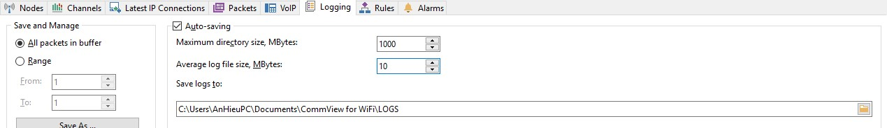
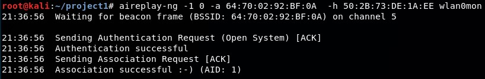
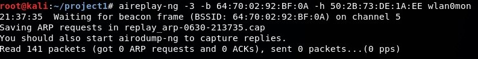
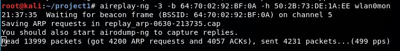
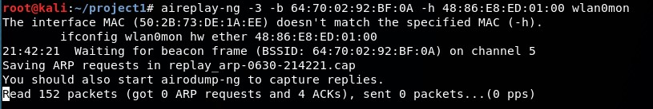
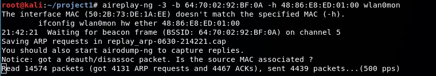

# REPRORT PROJECT: CrackWEP
Trường đại học Công Nghệ Thông Tin.  
Giảng viên: Lê Kim Hùng  
Môn học: An toàn không dây và di động.  
## 1. THÀNH VIÊN NHÓM
* Lê Ngọc Huy - 17520074
* An Văn Hiếu - 17520467
## 2. THÔNG SỐ THIẾT BỊ
Máy tấn công
```
> OS: Kali Linux 18 64bit  
> RAM: 2GB  
> CPU: i5 540m    
```

Wifi Adapter
```
> Tenda W311MA  
> MAC: 50:2B:73:DE:1A:EE   
```

Access Point
```
> TP Link TP-WR841N Version 8.2  
> MAC: 64:70:02:92:BF:0A
```

Thiết bị mô phỏng kết nối với Access Point
```
> SmartPhone Nokia Lumia 530  
> OS: Windows Phone 8.1  
> RAM: 512MB  
> MAC: 48:86:E8:ED:01:00 
```
## 3. TỔNG QUAN QUÁ TRÌNH
Bước 1: Tìm kiếm Access Point mục tiêu bằng airodump.  
Bước 2: Thu thập các gói tin trao đổi có chứa IV của Access Point mục tiêu với các thiết bị đã kết nối với nó.  
Bước 3: Phân tích các IV thu thập được và thực hiện crack. Nếu thất bại, quay lại bước 2.

## 4. CÁC BƯỚC CHI TIẾT
### Bước 1: Chuẩn bị môi trường
- Kết nối wifi adapter với máy ảo Kali.
- Mở Access Point và cài đặt chế độ bảo mật là WEP
- Kết nối điện thoại với Access Point
### Bước 2: Thiết lập chế độ monitor cho wifi adapter
Trên terminal máy ảo Kali:  
```
$ airmon-ng start wlan0
```


*<p align = "center">Hình 1. Khởi động chế độ monitor</p>*
Trong đó wlan0 là tên interface của wifi adapter. Sau bước này, interface của adapter này đổi tên thành wlan0mon.
### Bước 3: Tìm kiếm Access Point mục tiêu
Trên terminal máy ảo Kali:  
``` 
$ airmon-ng start wlan0
```


*<p align = "center">Hình 2. Các mạng wifi trong tầm phát hiện</p>*
Mạng wifi mục tiêu có tên TP-LINK_92BF0A
```
> Channel: 5  
> BSSID: 64:70:02:92:BF:0A  
> Encryt Method: WEP 
```

Chuyển channel lắng nghe của wifi adapter trùng với Access Point mục tiêu. Trên terminal máy ảo Kali: 
```
$ iwconfig wlan0mon channel 5
```
### Bước 4: Capture các gói tin của Access Point
#### Môi trường Kali Linux
Trên terminal máy ảo Kali: 
```
$ airodump-ng -c 5 --bssid 64:70:02:92:BF:0A -w WEP_crack wlan0mon
```
Dữ liệu được capture sẽ được lưu trữ tại tệp tin WEP_crack  

*<p align = "center">Hình 3. Thông tin về mạng wifi và các thiết bị kết nối tới nó</p>*
Một thiết bị kết nối đến wifi có địa chỉ MAC là `48:86:E8:ED:01:00`. Thiết bị này sẽ bị lợi dụng cho các bước tấn công sau này.
#### Môi trường Windows
Trên Windows, một công cụ khác được sử dụng để bắt các gói tin chứa IV là Commview.

Công cụ commview được sử dụng khá đơn giản do có GUI. Chỉ cần bật ứng dụng, thiết lập một số thông số cho việc capture và khởi động tiến trình capture.

Lưu ý: Commview chỉ hỗ trợ capture trên một số card mạng nhất định.

*<p align = "center">Hình 4. Thiết lập các thông số để bắt gói tin trong Commview</p>*

Bản miễn phí của Commview chỉ cho phép bắt gói tin trong 5 phút. Sau khi bắt được các gói tin, ta cần chuyển logging của commview về dạng file *.cap để công cụ aircrack có thể crack được mật khẩu (Bước 6).

### Bước 5: Tăng tốc độ thu thập gói tin
Có thể các thiết bị có ít kết nối đến access point nên số lượng gói tin thu thập không được nhiều, mất thời gian cho quá trình tấn công. Để tăng tốc độ thu thập các gói tin chứa IV, ta lợi dụng giao thức ARP.  

ARP là một giao thức truy vấn địa chỉ ở tầng data link (chẳng hạn MAC) khi có địa chỉ ở tầng Internet (chẳng hạn IPv4).  

Các thiết bị thường xuyên gửi gói tin ARP đến AP để truy vấn địa chỉ MAC của các thiết bị khác. Vì WEP không có cơ chế phòng thủ cho replay attack, ta có thể sniff các gói tin ARP Request xuất phát từ thiết bị gửi đến AP. Sau đó liên tục gửi lại nó cho AP.  

Sau khi AP nhận gói tin ARP Request, nó broadcast gói ARP Request đó cho toàn bộ các thiết bị khác với 1 IV mới. Ta vẫn sẽ liên tục gửi lại gói ARP Request đã sniff cho AP đến khi nó vẫn còn có hiệu lực.  

Lưu ý: Để AP nhận và xử lý gói ARP gửi đến, địa chỉ MAC nguồn của gói ARP phải thuộc 1 trong các client đã authenticate với AP.

#### Cách 1
Fake authenticate MAC address của wifi adapter trên máy ảo Kali với AP để AP nghĩ rằng attacker đã kết nối với nó, từ đó cho phép nhận và xử lý các gói tin đến từ attacker. Trên terminal máy ảo Kali
```
$ aireplay-ng -1 0 -a 64:70:02:92:BF:0A -h 50:2B:73:DE:1A:EE wlan0mon
```

*<p align = "center">Hình 5. Fake authentication</p>*
Lưu ý: 
* Mặc dù đã authenticate với AP, nhưng máy attacker vẫn không thể giao tiếp với AP một cách bình thường do không có WEP key để mã hóa và giải mã các gói tin.
* Vì AP sử dụng mã hóa WEP với phương thức xác thực là Open System Authentication nên có thể dễ dàng fake authenticate.
* Đối với mã hóa WEP sử dụng Shared Key, ta cần thu được PRGA xor file của những client đang kết nối với AP, từ đó mới có thể fake authenticate với AP.


*<p align = "center">Hình 6. Phương pháp Open System Authentication được kích hoạt trên AP</p>*

Thực hiện tấn công ARP Request Replay với địa chỉ MAC nguồn là địa chỉ MAC đã fake authenticate với AP.
```
$ aireplay-ng -3 -b 64:70:02:92:BF:0A -h 50:2B:73:DE:1A:EE wlan0mon
```


*<p align = "center">Hình 7. Cần chờ một khoảng thời gian để có thể lấy được 1 gói tin ARP Request phục vụ cho replay attack</p>*

*<p align = "center">Hình 8. Sau khi có được gói ARP Request bất kỳ</p>*
#### Cách 2
Thực hiện tấn công ARP Request Replay với địa chỉ MAC nguồn chính là địa chỉ MAC của một thiết bị đã kết nối với AP, do đó ta không cần fake authenticate với AP.  
Trên terminal máy ảo Kali:
```
$ aireplay-ng -3 -b 64:70:02:92:BF:0A -h 48:86:E8:ED:01:00 wlan0mon
```

*<p align = "center">Hình 9. Cần chờ một khoảng thời gian để có thể lấy được 1 gói tin ARP Request phục vụ cho replay attack</p>*

*<p align = "center">Hình 10. Sau khi có được gói ARP Request bất kỳ</p>*


### Bước 6: Crack mật khẩu WEP
Sau khi thu được hàng loạt gói tin chứa IV. Ta tiến hành phân tích và crack mật khẩu của WEP bằng câu lệnh:
```
aircrack-ng WEP_crack-01.cap
```

Đối với file .cap thu được từ Commview, vì các gói IV thu được từ nhiều AP khác nhau nên ta cần chỉ định AP cần crack, câu lệnh được biến đổi như sau:
```
aircrack-ng WEP_crack-01.cap -b 64:70:02:92:BF:0A
```
Với `WEP_crack-01.cap` là file thu được từ quá trình bắt gói tin của airodump-ng hoặc Commview.


*<p align = "center">Hình 11. Mật khẩu tìm được là xerus</p>*
