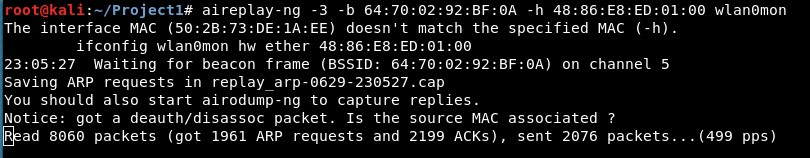

# REPRORT PROJECT: CrackWEP
Trường đại học Công Nghệ Thông Tin.  
Giảng viên: Lê Kim Hùng  
Môn học: An toàn không dây và di động.  
## 1. THÀNH VIÊN NHÓM
* Lê Ngọc Huy - 17520074
* An Văn Hiếu - 17520467
## 2. THÔNG SỐ THIẾT BỊ
Máy tấn công
> OS: Kali Linux 18 64bit  
> RAM: 2GB  
> CPU: i5 540m  

Wifi Adapter
> abc

Access Point
> TP Link TP-WR841N Version 8.2

Thiết bị mô phỏng kết nối với Access Point
> SmartPhone Nokia Lumia 530  
> OS: Windows Phone 8.1  
> RAM: 512MB  
## 3. TỔNG QUAN QUÁ TRÌNH
Bước 1: Tìm kiếm Access Point mục tiêu bằng airodump.  
Bước 2: Thu thập các gói tin trao đổi có chứa IV của Access Point mục tiêu với các thiết bị đã kết nối với nó.  
Bước 3: Phân tích các IV thu thập được và thực hiện crack. Nếu thất bại, quay lại bước 2.

## 4. CÁC BƯỚC CHI TIẾT
#### Bước 1: Chuẩn bị môi trường
- Kết nối wifi adapter với máy ảo Kali.
- Mở Access Point và cài đặt chế độ bảo mật là WEP
- Kết nối điện thoại với Access Point
#### Bước 2: Thiết lập chế độ monitor cho wifi adapter
Trên terminal máy ảo Kali:  
```
$ airmon-ng start wlan0
```


*<p align = "center">Hình 1. Khởi động chế độ monitor</p>*
Trong đó wlan0 là tên interface của wifi adapter. Sau bước này, interface của adapter này đổi tên thành wlan0mon.
#### Bước 3: Tìm kiếm Access Point mục tiêu
Trên terminal máy ảo Kali:  
``` 
$ airmon-ng start wlan0
```


*<p align = "center">Hình 2. Các mạng wifi trong tầm phát hiện</p>*
Mạng wifi mục tiêu có tên TP-LINK_92BF0A
> `Channel: 5`  
> `BSSID: 64:70:02:92:BF:0A`  
> `Encryt Method: WEP` 

Chuyển channel lắng nghe của wifi adapter trùng với Access Point mục tiêu. Trên terminal máy ảo Kali: 
```
$ iwconfig wlan0mon channel 5
```
#### Bước 4: Capture các gói tin của Access Point
Trên terminal máy ảo Kali: 
```
$ airodump-ng -c 5 --bssid 64:70:02:92:BF:0A -w WEP_crack wlan0mon
```
Dữ liệu được capture sẽ được lưu trữ tại tệp tin WEP_crack  

*<p align = "center">Hình 3. Thông tin về mạng wifi và các thiết bị kết nối tới nó</p>*
Một thiết bị kết nối đến wifi có địa chỉ MAC là `48:86:E8:ED:01:00`. Thiết bị này sẽ bị lợi dụng cho các bước tấn công sau này.
#### Bước 5: Fake Authentication
Để đảm có thể giao tiếp với Access Point cho công việc tấn công ARP Request Replay Attack, ta thực hiện fake authen đến AP mục tiêu.  
Vì Access Point đang ở chế độ Open System Authentication nên ta có thể dễ dàng Fake authen thông qua câu lệnh sau: 
```
aireplay-ng -1 0 -a 64:70:02:92:BF:0A -h 48:86:E8:ED:01:00 wlan0mon
```

*<p align = "center">Hình 4. Phương pháp Open System Authentication được kích hoạt trên AP</p>*

Lưu ý:  
* Sau khi fake authen, mặc dù ta đã có thể giao tiếp với AP nhưng cả 2 sẽ không hiểu nhau (không giải mã được gói tin) vì không có key.
* Tuy nhiên, ta có thể thực hiện replay attack bằng cách gửi lại một gói tin từ một client khác gửi đến AP vì WEP không có cơ chế phòng thủ cho loại tấn công này.

#### Bước 6: Tăng tốc độ thu thập gói tin có IV
Có thể các thiết bị có ít kết nối đến access point nên số lượng gói tin thu thập không được nhiều, mất thời gian cho quá trình tấn công. Để tăng tốc độ thu thập các gói tin chứa IV, ta lợi dụng giao thức ARP.  

ARP là một giao thức truy vấn địa chỉ ở tầng data link (chẳng hạn MAC) khi có địa chỉ ở tầng Internet (chẳng hạn IPv4).  

Các thiết bị thường xuyên gửi gói tin ARP đến AP để truy vấn địa chỉ MAC của các thiết bị khác. Vì WEP không có cơ chế phòng thủ cho replay attack, ta có thể sniff các gói tin ARP Request xuất phát từ thiết bị gửi đến AP. Sau đó liên tục gửi lại nó cho AP (tại đây, nếu ta không fake authen thì gói tin ARP sẽ bị từ chối).  

Sau khi AP nhận gói tin ARP Request, nó broadcast gói ARP Request đó cho toàn bộ các thiết bị khác. Tại đây, các gói tin chứa IV được sinh ra. 

Ta vẫn sẽ liên tục gửi lại gói ARP Request đã sniff cho AP đến khi nó vẫn còn có hiệu lực.  
Để thực hiện ARP Request replay attack, trên terminal máy ảo Kali, chạy câu lệnh:
```
$ aireplay-ng -3 -b 64:70:02:92:BF:0A -h 48:86:E8:ED:01:00 wlan0mon
```


*<p align = "center">Hình 5. Giao diện câu lệnh sau khi chạy công cụ tấn công. Cần chờ một khoảng thời gian để có thể lấy được 1 gói tin ARP Request</p>*

*<p align = "center">Hình 6. Sau khi có được gói ARP Request bất kỳ</p>*

#### Bước 7: Crack mật khẩu WEP
Sau khi thu được hàng loạt gói tin chứa IV. Ta tiến hành phân tích và crack mật khẩu của WEB bằng câu lệnh:
```
aircrack-ng WEP_crack-01.cap
```
Với `WEP_crack-01.cap` là file thu được từ quá trình bắt gói tin của `airodump-ng`.

*<p align = "center">Hình 7. Mật khẩu tìm được là xerus</p>*
